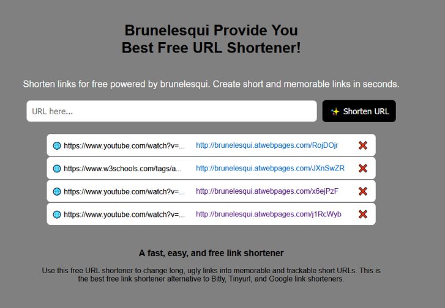

# 🔗 URL Shortener

Un sencillo acortador de URLs hecho con **HTML**, **CSS**, **JavaScript** y **PHP** (con MySQL como base de datos). 
Permite generar URLs cortas que redirigen a URLs largas.

---

## 🚀 Funcionalidades

- Acortar cualquier URL válida.
- Visualizar una tabla con todas las URLs acortadas.
- Eliminar una URL de la lista desde el frontend.
- Redirección automática al ingresar la URL corta.
- Interfaz amigable y ligera.

---

## 🖼️ Vista previa

 

---

## 🧱 Tecnologías utilizadas

- **Frontend**: HTML, CSS, JavaScript
- **Backend**: PHP 
- **Base de datos**: MySQL (tabla `freetable_urls`)

---

## 📦 Estructura del proyecto

```
/UrlShortener/
 ├── server/
 │   ├── add_url.php # Endpoint para acortar una URL
 │   ├── get_all_urls.php # Endpoint para obtener todas las URLs
 │   ├── db_config.php # Conexión a la base de datos
 │   ├── db_credentials.php # Datos para conectarse a la base de datos
 ├── redirect.php # Script para redirigir URLs cortas
 ├── README.md
 ├── urlshortener.php # Interfaz principal
 └── UrlShortener.php # Clase PHP que gestiona la lógica
```

---

## ⚙️ Instalación y configuración

1. **Clonar el repositorio** o copiar los archivos en tu servidor.
2. Crear la base de datos en MySQL:

```sql
CREATE TABLE freetable_urls (
  id INT AUTO_INCREMENT PRIMARY KEY,
  short_code VARCHAR(10) NOT NULL UNIQUE,
  long_url TEXT NOT NULL,
  created_at TIMESTAMP DEFAULT CURRENT_TIMESTAMP
);
```

Acceder al proyecto desde el navegador:
http://localhost/urlshortener.php

---

## 🧪 Cómo usar

Escribí una URL en el campo de entrada y hacé clic en Shorten URL.
Se generará un código corto y se agregará a la tabla.
Hacé clic en el código corto para probar la redirección.
Presioná ❌ para eliminar una entrada (solo del frontend).

---

## 📌 Notas

Las URLs se almacenan en la base de datos.
Se recomienda implementar validaciones y seguridad adicionales para producción (como sanitización, verificación de URLs válidas, tokens, etc).

---

## 📄 Licencia

Este proyecto está bajo la licencia MIT.

---

## ✍️ Autor

Desarrollado por brunelesqui 🚀